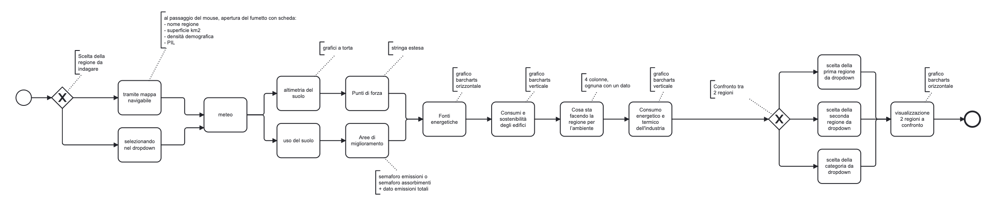

# CAN 🌍 Cambiamento Ambientale Nazionale

### Analisi e visualizzazione dei dati ambientali ed energetici regionali italiani

---

## 📖 Descrizione

**CAN Dashboard** è un progetto completo che integra:
- un **backend FastAPI** per la gestione e l’esposizione dei dati ambientali regionali italiani;
- un **frontend Dash/Plotly** per la visualizzazione interattiva di mappe e grafici;
- un **database MySQL** gestito tramite Docker, per garantire persistenza e scalabilità.

L’obiettivo è offrire una panoramica chiara e interattiva della transizione energetica italiana, fornendo uno strumento utile a enti, analisti e cittadini.

---

## ⏺️ Diagramma

Il flusso logico di navigazione della dashboard è rappresentato nel seguente diagramma BPMN:


*(Mostra il percorso dell’utente tra mappa, dati meteo, suolo, energia, edifici, industria e comparazione regioni.)*

🔗 [Visualizza il file sorgente BPMN](docs/can.bpmn)

---

## 🧩 Architettura generale

| Componente | Descrizione | Tecnologie principali |
|-------------|--------------|------------------------|
| **Backend (API)** | Fornisce endpoint REST per CRUD e consultazione dei dati | FastAPI, SQLAlchemy, PyMySQL |
| **Frontend (Dashboard)** | Interfaccia interattiva per la visualizzazione dei dati | Dash, Plotly, Bootstrap |
| **Database** | Archiviazione strutturata dei dati ambientali e regionali | MySQL, Docker |

---

## 📂 Struttura del progetto

```
CAN/
│
├── backend/                     # Backend FastAPI
│   ├── main.py                 # Avvio FastAPI e registrazione router
│   ├── routes.py               # Endpoint API per ogni tabella
│   ├── models.py               # Modelli SQLAlchemy
│   ├── schemas.py              # Schemi Pydantic
│   ├── services.py             # Logica CRUD separata dalle route
│   ├── database.py             # Connessione e motore MySQL
│   ├── popola_tabelle.py       # Script di popolamento iniziale del DB
│   ├── can_dump.sql            # Dump SQL di riferimento
│   ├── dockerfile              # Dockerfile backend
│   └── requirements.txt        # Dipendenze backend
│
├── frontend/                   # Dashboard interattiva (Dash + Plotly)
│   ├── app.py                  # File principale: avvio dell’app
│   ├── api.py                  # Funzioni di richiesta ai servizi FastAPI
│   ├── data_utils.py           # Utilità comuni
│   ├── __init__.py
│   │
│   ├── components/             # Componenti UI della dashboard
│   │   ├── navbar.py
│   │   ├── mappa.py
│   │   ├── meteo.py
│   │   ├── suolo.py
│   │   ├── swot.py
│   │   ├── fonti.py
│   │   ├── edifici.py
│   │   ├── industria.py
│   │   ├── azioni.py
│   │   ├── comparazione.py
│   │   └── footer.py
│   │
│   ├── callbacks/              # Logica interattiva per ogni sezione
│   │   ├── navbar_callbacks.py
│   │   ├── mappa_callbacks.py
│   │   ├── meteo_callbacks.py
│   │   ├── swot_callbacks.py
│   │   ├── fonti_callbacks.py
│   │   ├── edifici_callbacks.py
│   │   ├── industria_callbacks.py
│   │   ├── azioni_callbacks.py
│   │   ├── legend_callbacks.py
│   │   └── comparazione_callbacks.py
│   │
│   ├── assets/                 # File statici
│   │   ├── style.css           # Stile globale
│   │   ├── pannello.png
│   │   ├── palaeolica.png
│   │   ├── autoelettrica.png
│   │   └── casa.png
│   │
│   ├── limits_IT_regions.geojson # Dati geografici delle regioni italiane
│   ├── meteo.env                  # API key OpenWeather
│   ├── dockerfile                 # Dockerfile frontend
│   └── requirements.txt           # Dipendenze frontend
│
├── DB/                           # Dati e volume MySQL
│   ├── *.csv                      # Dataset originali
│   ├── can_dump.sql               # Dump SQL importabile
│   ├── dockerfile                 # Dockerfile del servizio MySQL
│   └── mysqldata/                 # Volume persistente
│
├── playground/                   # Codice sperimentale / esercizi
│   └── auth/                     # Funzionalità di autenticazione (non incluse in CAN)
│       ├── auth_app.py
│       ├── auth_config.json
│       ├── auth_core.py
│       ├── auth_utils.py
│       ├── routes_auth.py
│       ├── users.json
│       └── templates/
│           ├── forgot.html
│           ├── login.html
│           ├── register.html
│           └── reset.html
│
├── .devcontainer/                # Cloudspaces
│   └── devcontainer.json         # Avvio Cloudspaces
│
├── backupSQL/                    # Backup automatico DB (futuro)
│
├── .env.codespaces               # File per l'avvio dei container in Celoudspaces
│
├── dump_mysql.py                 # Script per creare un dump MySQL (futuro)
├── import_mysql.py               # Script per importare il dump (futuro)
│
├── docker-compose.yml            # Avvio container (DB, backend, frontend)
│
├── docs/                         # Documentazione e diagrammi
│   ├── manuale_utente.txt
│   ├── can.bpmn
│   ├── can_bpmn.png
│   ├── backend.html              # Documentazione generata (PyDoc)
│   └── frontend.html             # Documentazione generata (PyDoc)
│
├── .gitignore
├── .dockerignore
└── README.md
```

---

## ⚙️ Setup e installazione

### Clona il repository
```bash
git clone https://github.com/<nome_repo>/CAN.git
cd CAN
```

---

## ▶️ Avvio dei servizi (3 opzioni)

### 🔹 Opzione 1 – 🚀 Prova CAN in cloud (GitHub Codespaces)

Hai già un account GitHub e vuoi provare CAN **senza installare nulla**?

[](https://codespaces.new/charliedev13/CAN)

▶️ Passo 1 - **Clicca “Create codespace”** per avviare l’ambiente cloud.
▶️ Passo 2 — Attendi qualche secondo l’**avvio automatico**.
▶️ Passo 3 — Quando Codespaces è pronto, vai nella scheda **Ports** (in basso) e apri la porta **8050** cliccando su.

1. Clicca sul pulsante “Try CAN in Codespaces” e poi su **Create codespace**.
2. Attendi che l’ambiente sia pronto (qualche secondo).
3. Vai nella scheda **Ports** e apri la porta **8050** cliccando su 🌐.

---

### 🔹 Opzione 2 – Avvio completo con Docker (consigliato)

Docker gestisce tutto automaticamente: **non serve creare né attivare ambienti virtuali** o installare manualmente le dipendenze Python.

```bash
# avvia tutti i container
docker compose up -d
```

#### Accessi rapidi:
- **phpMyAdmin** → [http://localhost:8080](http://localhost:8080)  
- **Backend FastAPI** → [http://localhost:8000/docs](http://localhost:8000/docs)  
- **Frontend Dash** → [http://localhost:8050](http://localhost:8050)

---

### 🔹 Opzione 3 – Avvio manuale in locale

#### 1️⃣ Crea e attiva un ambiente virtuale
```bash
# macOS/Linux
python3 -m venv venv        
source venv/bin/activate  

# Windows
python -m venv venv
venv\Scripts\activate       
```

#### 2️⃣ Installa le dipendenze
```bash
# macOS/Linux
pip3 install -r backend/requirements.txt
pip3 install -r frontend/requirements.txt

# Windows
pip install -r backend/requirements.txt
pip install -r frontend/requirements.txt
```

#### 3️⃣ Avvia i servizi

- **Database**
  ```bash
  cd DB
  docker compose up -d
  ```
  + Apri [http://localhost:8080](http://localhost:8080)
  + Accedi a phpMyAdmin → Importa → `can_dump.sql` → Esegui

- **Backend**
  ```bash
  cd backend
  uvicorn main:app --reload --port 8000
  ```

- **Frontend**
  *(lascia aperto il terminale del backend e aprine un altro)*
  ```bash
  cd frontend
  python -m frontend.app
  ```

---

## 🧮 Dipendenze principali

- **Python ≥ 3.9**
- **FastAPI**, **SQLAlchemy**, **PyMySQL**, **Uvicorn**
- **Dash**, **Plotly**, **Dash Bootstrap Components**
- **Pandas**, **python-dotenv**
- **Docker**, **MySQL**, **phpMyAdmin**

---

## 🚀 Deploy e containerizzazione

### 🐳 Docker Compose (completo: backend + frontend + DB)

Esempio di `docker-compose.yml` funzionante per l’intero stack:

```yaml
version: "3.9"

services:
  db:
   image: mysql:8.0
   container_name: mysql_container
   restart: always
   env_file:
     - .env
   environment:
     MYSQL_USER: ${MYSQL_USER}
     MYSQL_PASSWORD: ${MYSQL_PASSWORD}
     MYSQL_DATABASE: ${MYSQL_DATABASE}
     MYSQL_ROOT_PASSWORD: ${MYSQL_ROOT_PASSWORD}
   ports:
     - "3306:3306"
   volumes:
     - mysql_data:/var/lib/mysql
     - ./DB/can_dump.sql:/docker-entrypoint-initdb.d/can_dump.sql
   networks:
     - can_networkup
   healthcheck:
     test: ["CMD-SHELL", "mysqladmin ping -h localhost -u root -p$MYSQL_ROOT_PASSWORD || exit 1"]
     interval: 10s
     timeout: 5s
     retries: 10
     start_period: 20s

  #per production (messa online), commentare phpmyadmin 
  phpmyadmin:
   image: phpmyadmin/phpmyadmin
   container_name: phpmyadmin_container
   restart: always
   env_file:
     - .env
   environment:
     PMA_HOST: db
     PMA_USER: ${PMA_USER}
     PMA_PASSWORD: ${PMA_PASSWORD}
   ports:
     - "8080:80"
   depends_on:
     db:
       condition: service_healthy

  backend:
    build: 
      context: ./backend
      dockerfile: dockerfile
    image: can-backend
    container_name: backend_container
    restart: always
    env_file:
      - .env
    environment:
      DB_HOST: ${DB_HOST}
      DB_USER: ${DB_USER}
      DB_PASSWORD: ${DB_PASSWORD}
      DB_NAME: ${DB_NAME}
      URL_PASSWORD_DB: ${URL_PASSWORD_DB}
    ports:
      - "8000:8000"
    volumes:
      - ./backend:/app
    depends_on:
      db:
        condition: service_healthy
    networks:
      - can_networkup

  frontend:
    build:  
      context: ./frontend
      dockerfile: dockerfile
    image: can-frontend
    container_name: frontend_container
    restart: always 
    env_file:
      - .env
    environment:
       BASE_URL: ${BASE_URL}
       WEATHER_API_KEY: ${WEATHER_API_KEY}
    ports:
      - "8050:8050"
    volumes:
      - ./frontend:/app/frontend
    depends_on:
      - backend
    networks:
      - can_networkup
    command: >
      sh -c "python -m frontend.app"

networks:
  can_networkup:
    driver: bridge

volumes:
  mysql_data:
```

---

## 🧠 Documentazione

### ▶️ Swagger UI
🔗 [http://localhost:8000/docs](http://localhost:8000/docs)

### 🟙️ Dashboard interattiva
🔗 [http://localhost:8050](http://localhost:8050)

### 🗞️ Pydoc
Genera la documentazione automatica di entrambi i moduli:

```bash
python -m pydoc -w frontend
python -m pydoc -w backend
```

Gli output HTML vengono salvati nella cartella `CAN/docs`.

---

## 🧱 Porte e servizi

| Servizio | Porta | Descrizione |
|-----------|-------|-------------|
| MySQL | 3306 | Database CAN |
| phpMyAdmin | 8080 | Interfaccia grafica per il DB |
| FastAPI | 8000 | Backend API |
| Dash | 8050 | Frontend interattivo |

---

## 🏷️ Versione e changelog

- **v1.0.0** – Struttura completa e modulare:
  - Frontend Dash componentizzato (layout + callback separati)
  - Backend FastAPI con CRUD e documentazione Swagger
  - Cache meteo e integrazione OpenWeather
  - Database MySQL

---

## 👥 Autori

**Team CAN**  
Progetto di sviluppo e comunicazione per la transizione energetica e ambientale.

- Carlotta Forlino  
- Andrea Calabrò  
- Nicolò Giraudo

